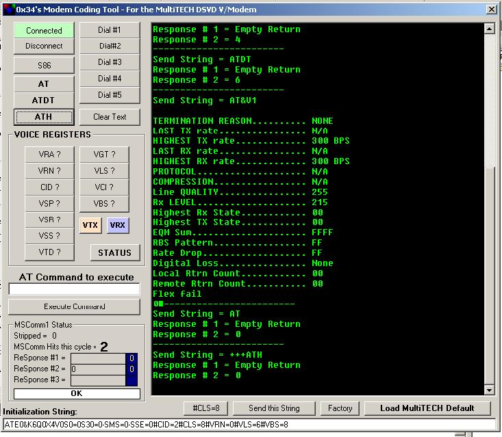



## Modem Tool

### Description

Program to help in protocol development with MultiTECH DSVD Voice Modem. Can be used with any COMM device. Good tool for learning COMM control.
 
### More Info
 

             |
---                |---
**Submitted On**   |2003-11-27 15:38:38
**By**             |[0x34](https://github.com/Planet-Source-Code/PSCIndex/blob/master/ByAuthor/0x34.md)
**Level**          |Intermediate
**User Rating**    |5.0 (20 globes from 4 users)
**Compatibility**  |VB 6\.0
**Category**       |[Files/ File Controls/ Input/ Output](https://github.com/Planet-Source-Code/PSCIndex/blob/master/ByCategory/files-file-controls-input-output__1-3.md)
**World**          |[Visual Basic](https://github.com/Planet-Source-Code/PSCIndex/blob/master/ByWorld/visual-basic.md)
**Archive File**   |[Modem\_Tool16769811272003\.zip](https://github.com/Planet-Source-Code/0x34-modem-tool__1-50158/archive/master.zip)

